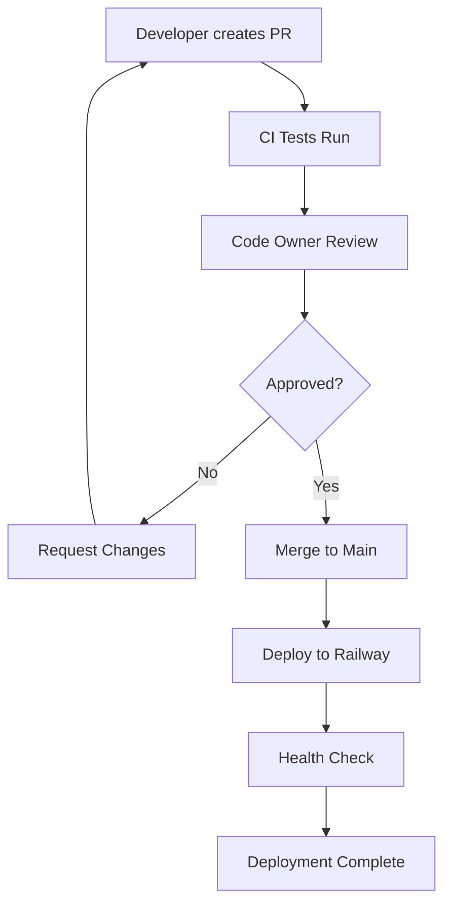

# CI/CD Pipeline Setup Guide

This document explains the complete CI/CD pipeline setup for the HDFC PDF Converter project.

## Overview

The CI/CD pipeline ensures:
- ✅ **Code Quality**: Automated testing on multiple Python versions
- ✅ **Docker Validation**: Container builds and health checks
- ✅ **Approval Workflow**: Required code owner approval for changes
- ✅ **Automatic Deployment**: Railway deployment on main branch updates
- ✅ **Health Verification**: Post-deployment health checks

## Pipeline Flow



## GitHub Actions Workflows

### 1. Main CI/CD Pipeline (`.github/workflows/ci.yml`)

**Triggers:**
- Push to `main` branch
- Pull requests to `main` branch

**Jobs:**

#### Test Job
- Runs on Python 3.9, 3.10, 3.11
- Installs dependencies and runs pytest
- Must pass before any deployment

#### Docker Test Job
- Builds Docker image using Docker Buildx
- Tests container startup and health endpoint
- Uses GitHub Actions cache for faster builds

#### Deploy Job (Main branch only)
- Deploys to Railway using Railway CLI
- Waits for deployment completion
- Verifies deployment with health check

### 2. Branch Protection Setup (`.github/workflows/setup-branch-protection.yml`)

**Purpose:** One-time setup for branch protection rules

**Features:**
- Requires status checks to pass
- Requires code owner approval
- Prevents force pushes and deletions

## Required GitHub Secrets

Add these secrets to your GitHub repository:

### `RAILWAY_TOKEN`
1. Go to Railway dashboard
2. Navigate to your project settings
3. Generate a new token
4. Add to GitHub Secrets as `RAILWAY_TOKEN`

### `GITHUB_TOKEN` (Automatic)
- Automatically provided by GitHub Actions
- Used for branch protection setup

## Branch Protection Rules

### Main Branch Protection
- **Required Status Checks**: `test`, `docker-test`
- **Required Reviews**: 1 approval from code owners
- **Dismiss Stale Reviews**: Yes
- **Require Code Owner Reviews**: Yes
- **Allow Force Pushes**: No
- **Allow Deletions**: No

### Code Owners
- All files require approval from `@vishwarajapathi`
- Critical files (Dockerfile, Railway config) have specific owners

## Railway Deployment

### Automatic Deployment
- Triggered on push to `main` branch
- Uses Railway CLI for deployment
- Service name: `web`
- Health check endpoint: `/health`

### Manual Deployment
```bash
# Using Railway CLI
railway up --service web

# Using Docker Hub
docker run -p 5000:5000 vishwa86/hdfc-pdf-converter:latest
```

## Development Workflow

### 1. Feature Development
```bash
# Create feature branch
git checkout -b feature/new-feature

# Make changes and commit
git add .
git commit -m "Add: new feature"

# Push and create PR
git push origin feature/new-feature
```

### 2. Pull Request Process
1. **Create PR** using the provided template
2. **CI Tests Run** automatically
3. **Code Review** by code owners
4. **Approval Required** before merge
5. **Merge to Main** triggers deployment

### 3. Deployment Process
1. **Merge to Main** triggers deployment
2. **Railway Deployment** starts automatically
3. **Health Check** verifies deployment
4. **Success Notification** confirms deployment

## Monitoring and Troubleshooting

### CI/CD Status
- Check GitHub Actions tab for pipeline status
- Review logs for failed jobs
- Monitor Railway deployment logs

### Common Issues

#### Failed Tests
- Check Python version compatibility
- Verify test dependencies
- Review test output for specific failures

#### Docker Build Failures
- Check Dockerfile syntax
- Verify all dependencies are available
- Review build logs for missing packages

#### Railway Deployment Issues
- Verify `RAILWAY_TOKEN` secret is set
- Check Railway service configuration
- Review Railway deployment logs

#### Health Check Failures
- Verify application starts correctly
- Check health endpoint implementation
- Review container logs for errors

## Security Considerations

### Secrets Management
- Never commit secrets to repository
- Use GitHub Secrets for sensitive data
- Rotate Railway tokens regularly

### Code Review
- All changes require approval
- Code owners review critical files
- Security-sensitive changes get extra scrutiny

### Deployment Security
- Railway deployment uses secure tokens
- Health checks verify application integrity
- Automatic rollback on health check failures

## Performance Optimization

### CI/CD Speed
- Use GitHub Actions cache for dependencies
- Parallel job execution where possible
- Docker layer caching for faster builds

### Deployment Speed
- Railway's optimized deployment process
- Health check timeout configuration
- Efficient container startup

## Rollback Procedures

### Automatic Rollback
- Health check failures trigger automatic rollback
- Railway maintains previous deployment versions

### Manual Rollback
```bash
# Using Railway CLI
railway rollback --service web

# Using Docker Hub
docker run -p 5000:5000 vishwa86/hdfc-pdf-converter:previous-tag
```

## Best Practices

### Code Quality
- Write comprehensive tests
- Follow coding standards
- Use meaningful commit messages

### Deployment
- Test changes locally first
- Use feature branches for development
- Keep main branch stable

### Monitoring
- Monitor deployment health
- Set up alerts for failures
- Regular security updates

## Support

For CI/CD issues:
1. Check GitHub Actions logs
2. Review Railway deployment logs
3. Create an issue with detailed information
4. Contact maintainers for critical issues
